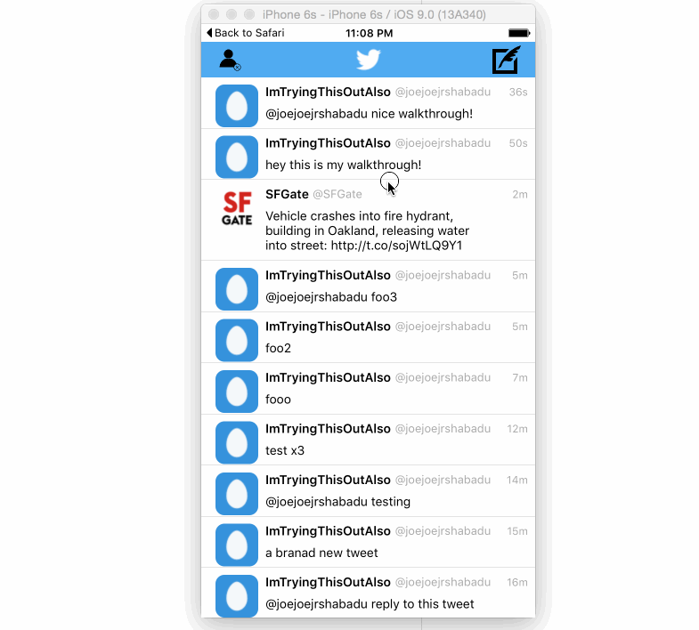

## Twitter 

This is a basic twitter app to read and compose tweets the [Twitter API](https://apps.twitter.com/).

Time spent: `21`

### Features
- user can sign into twitter usign OAuth login flow
- signed in user is persisted across restarts
- user can view last 200 tweets in home timeline
- user can create new tweets
- new tweets are automatically added to the home timeline without fetching from twitter api
- user can favorite or retweet a tweet
- user can unfavorite a tweet
- user can reply to a user for a given tweet
- user sees a character countdown when composing a new tweet. shows how many characters remaining until limit of 140 is reached. if limit is reached, the 'tweet' button is disabled.  also, the remaining characters font color changes to red when approaching the limit of 140, or if exceeding the limit.
- favoriting a tweet increases the count
- user can't click links in tweet text while in the home timeline view, but can click on links while in the detail view
- all twitter api hidden behind a singleton

#### Required

- [x] User can sign in using OAuth login flow
- [x] User can view last 20 tweets from their home timeline
- [x] The current signed in user will be persisted across restarts
- [x] In the home timeline, user can view tweet with the user profile picture, username, tweet text, and timestamp.  In other words, design the custom cell with the proper Auto Layout settings.  You will also need to augment the model classes.
- [x] User can pull to refresh
- [x] User can compose a new tweet by tapping on a compose button.
- [x] User can tap on a tweet to view it, with controls to retweet, favorite, and reply.
- [-] User can retweet, favorite, and reply to the tweet directly from the timeline feed.
   - user can't do the above from the timeline feed. can only do these actions after tapping on the tweet.
   - user can unfavorite a tweet too.
  
#### Optional

- [x] When composing, you should have a countdown in the upper right for the tweet limit.
  - it's in the lower left next to the 'tweet' button. also, the 'tweet' button is disabled if exceeding the tweet limit.  
  - the count and tweet button will automatically relocate if the keyboard appears. 
- [x] After creating a new tweet, a user should be able to view it in the timeline immediately without refetching the timeline from the network.
- [-] Retweeting and favoriting should increment the retweet and favorite count.
  - only favoriting increments the count
- [-] User should be able to unretweet and unfavorite and should decrement the retweet and favorite count.
  - only unfavoriting decrements the count. 
- [x] Replies should be prefixed with the username and the reply_id should be set when posting the tweet,
- [ ] User can load more tweets once they reach the bottom of the feed using infinite loading similar to the actual Twitter client.

### Walkthrough

### Credits
* [Twitter API](https://apps.twitter.com/)
* [BDBOAuth1Manager](https://github.com/bdbergeron/BDBOAuth1Manager)
* [SwiftyJSON](https://github.com/SwiftyJSON/SwiftyJSON)
* follow icon: Add Contact by Mike Ashley from the Noun Project
* following icon: Verified User by Keta Shah from the Noun Project
* logout icon: User by José Manuel de Laá from the Noun Project
* compose icon: quill by Simple Icons from the Noun Project
* my wife for letting me do this again
* homer simpson for coming up with the name joey joe joe jr shabadu
